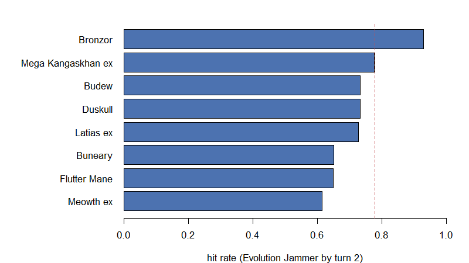

# How the Bronzong simulator works

*Kevin Z. Lin &mdash; 2026-08-29*


# Overview

This is a walkthrough of the simulator as it stands, built to be argued with.
The policy it runs — `R/decision_claude.R` — is a **first draft translation of
`docs/03_decision_tree.md`**, written so the tree and the code can be read side
by side. It will make choices you disagree with. Those disagreements are the
output this document is for.

**The question the whole thing answers:** over many simulated games, how often
can the player attack with **Evolution Jammer on or before their own turn 2**?
One fixed bar, the same going first and going second (ADR 0004), reported
separately for the two coin-flip branches and never pooled (ADR 0002).

| Stage | What it does | Functions |
|---|---|---|
| Setup | Shuffle, mulligan, place the Active, set prizes | `setup_game()`, `policy_placement()` |
| Turns 1–2 | Draw, then play the decision tree | `policy_turn()`, `play_replicate()` |
| Measure | One replicate → hit / miss, turn achieved, diagnosis | `summarise_replicate()` |
| Aggregate | Many replicates → one rate per cell | `summarise_run()` |
| Diagnose | A stratified sample of readable traces | `write_trace_file()` |

Two things the simulator is careful about, because both are easy to get silently
wrong:

- **The policy may not see hidden information** (ADR 0003). It reads the hand,
  the board and the discard, plus a belief state that only learns what a real
  player would learn. A search that fails because the card was prized is
  information the player *earns*.
- **Mulligans are never a miss** (ADR 0005). A hand with no Basic is redrawn and
  the redraw is played; the cost is reported beside the rate, never folded into
  it.

``` r
for(one_file in list.files("../R", pattern = "[.]R$", full.names = TRUE)){
  source(one_file)
}

card_df <- build_card_database()
decklist <- read_decklist("../decklists/decklist2.txt", card_df)
```

# The deck

`decklist2`, chosen because it runs **both** Salvatore and Latias ex — so the
turn-1 kill line and the free-retreat rung of the §4.3 ladder both get
exercised.

``` r
count_vec <- decklist$count_vec
data.frame(count = as.integer(count_vec),
           card = lookup_card(card_df, names(count_vec))$name,
           row.names = NULL)
```

```
   count                        card
1      1                       Budew
2      2             Night Stretcher
3      2          Mega Kangaskhan ex
4      2               Boss's Orders
5      4      Lillie's Determination
6      4                  Rare Candy
7      3                      Switch
8      4                  Ultra Ball
9      2                     Buneary
10     2             Mega Lopunny ex
11     1                   Meowth ex
12     4                    Poke Pad
13     4   Telepathic Psychic Energy
14     4                     Duskull
15     2                    Dusclops
16     4                    Dusknoir
17     1                   Latias ex
18     1            Enriching Energy
19     2                     Bronzor
20     2                    Bronzong
21     1                Flutter Mane
22     2 Ciphermaniac's Codebreaking
23     1                   Salvatore
24     1               Jamming Tower
25     4                       Hilda
```

The four sub-goals that must all hold at the attack step, from §1 of the
decision tree:

| | Sub-goal | Satisfied by |
|---|---|---|
| **A** | A Bronzor is in play | setup, Poké Pad, Ultra Ball, Brock's Scouting, benching one |
| **B** | Bronzong is on it | Hilda, Salvatore, or drawn and evolved |
| **C** | Bronzong is **Active** | led at setup, free retreat, Switch, Surfer, Run Around, Cursed Blast |
| **D** | A `[P]` source is attached | basic Psychic or Telepathic Psychic Energy |

# One game, played slowly

The most useful part of this document. A single seed, going second, played turn
by turn — every decision the policy takes is logged as it happens.

``` r
seed_number <- 8L

pair <- setup_game(decklist, card_df,
                   bool_going_first = FALSE,
                   placement_fn = policy_placement,
                   seed_number = seed_number)

print(paste0("opening hand: ",
             paste0(lookup_card(card_df, pair$state$hand_vec)$name,
                    collapse = ", ")))
print(paste0("led: ", lookup_card(card_df, top_card(pair$state$active))$name))
print(paste0("bench: ", length(pair$state$bench_list), " Pokemon"))
```

```
[1] "opening hand: Telepathic Psychic Energy, Salvatore, Telepathic Psychic Energy, Rare Candy, Rare Candy, Dusknoir"
[1] "led: Flutter Mane"
[1] "bench: 0 Pokemon"
```

Note the empty Bench. §3 says to place the Active and stop: a benched Basic can
never be un-benched, and the slots are wanted for Latias ex.

## Turn 1

``` r
pair$state <- begin_turn(pair$state)
pair <- draw_to_hand(pair, num_cards = 1L)
pair <- policy_turn(pair)

writeLines(readable_log(pair$state, turn_number = 1L))
```

```
attach TelepathicPsychicEnergy to FlutterMane
Telepathic Psychic Energy -> Bronzor(TEF), Latiasex
evolve into Bronzong
Salvatore -> Bronzong
promote Bronzong via retreat(free)
```

## Turn 2

``` r
pair$state <- begin_turn(pair$state)
pair <- draw_to_hand(pair, num_cards = 1L)
pair <- policy_turn(pair)

writeLines(readable_log(pair$state, turn_number = 2L))
```

```
attach TelepathicPsychicEnergy to Bronzong
Telepathic Psychic Energy -> Duskull, Bronzor(TEF)
EVOLUTION JAMMER
```

## What the window closed on

``` r
result <- summarise_replicate(pair, decklist$decklist_id, seed_number,
                              bool_keep_trace = TRUE)

print(paste0("hit: ", result$bool_hit,
             "   turn achieved: ", result$jammer_turn))
writeLines(result$trace_vec)
```

```
[1] "hit: TRUE   turn achieved: 2"
#8  HIT t2
  setup hand[RareCandy+RareCandy+TelepathicPsychicEnergy+TelepathicPsychicEnergy+Dusknoir+FlutterMane+Salvatore] | lead FlutterMane
  T1    attach TelepathicPsychicEnergy to FlutterMane | Telepathic Psychic Energy -> Bronzor(TEF), Latiasex | evolve into Bronzong | Salvatore -> Bronzong | promote Bronzong via retreat(free)
  T2    attach TelepathicPsychicEnergy to Bronzong | Telepathic Psychic Energy -> Duskull, Bronzor(TEF) | EVOLUTION JAMMER
  end of turn 2 -- board state when the window closed; setup lead=FlutterMane
    active   Bronzor(TEF)>Bronzong[P]{TelepathicPsychicEnergy} played=T1 evo=T1
    bench    FlutterMane[P]{TelepathicPsychicEnergy} played=T0 | Latiasex[P] played=T1 | Duskull[P] played=T2 | Bronzor(TEF)[P] played=T2
    hand     RareCandy, RareCandy, Dusknoir, BosssOrders, Buneary
    discard  Salvatore
    zones    deck=40 prizes=6 stadium=-
    turn     energy=spent supporter=unplayed items=open
    prized   GROUND TRUTH, never visible to the policy (ADR 0003): Duskull, Budew, PokePad, Bronzong, NightStretcher, TelepathicPsychicEnergy
```

That block is what a trace looks like. `end of turn 2` is recorded in full
(ADR 0007) because the board reached by turn 2 is a question worth asking later,
and the window stops there — there is no turn 3 anywhere in the simulator.

# Both cells, at scale

Going first and going second are different games and get different numbers. Each
cell is 1,000 replicates of the `clear` scenario.

``` r
num_replicates <- 1000L

run_cell <- function(bool_going_first, scenario = "clear"){
  lapply(seq_len(num_replicates), function(i){
    one_pair <- play_replicate(decklist, card_df,
                               bool_going_first = bool_going_first,
                               scenario = scenario,
                               seed_number = i)
    summarise_replicate(one_pair, decklist$decklist_id, i)
  })
}

second_list <- run_cell(bool_going_first = FALSE)
first_list <- run_cell(bool_going_first = TRUE)

second_summary <- summarise_run(second_list)
first_summary <- summarise_run(first_list)

data.frame(cell = c("going second", "going first"),
           hit_rate = c(second_summary$hit_rate, first_summary$hit_rate),
           turn1 = c(second_summary$turn_tally_vec[["t1"]],
                     first_summary$turn_tally_vec[["t1"]]),
           turn2 = c(second_summary$turn_tally_vec[["t2"]],
                     first_summary$turn_tally_vec[["t2"]]),
           never = c(second_summary$turn_tally_vec[["never"]],
                     first_summary$turn_tally_vec[["never"]]),
           row.names = NULL)
```

```
          cell hit_rate turn1 turn2 never
1 going second    0.778    31   747   222
2  going first    0.639     0   639   361
```

Going second hits on turn 1 sometimes and going first never does — that is
Salvatore, and it is the only place its speed is visible, because the primary
outcome deliberately prices a turn-1 kill and a turn-2 conventional line the
same.

**Mulligans, reported beside the rate and never inside it** (ADR 0005):

``` r
data.frame(cell = c("going second", "going first"),
           mulligan_rate = c(second_summary$mulligan_rate,
                             first_summary$mulligan_rate),
           mean_mulligans = c(second_summary$mean_mulligans,
                              first_summary$mean_mulligans),
           row.names = NULL)
```

```
          cell mulligan_rate mean_mulligans
1 going second         0.135          0.149
2  going first         0.135          0.149
```

## Which sub-goal actually fails

Counted as a **set**, so a miss appears in every row it belongs to. Rows sum to
more than the miss count on purpose: reporting only the first unmet sub-goal
made C look like it never failed, which is the exact opposite of the truth.

``` r
data.frame(subgoal = names(SUBGOAL_VEC),
           meaning = as.character(SUBGOAL_VEC),
           going_second = as.integer(second_summary$unmet_tally_vec),
           going_first = as.integer(first_summary$unmet_tally_vec),
           row.names = NULL)
```

```
  subgoal          meaning going_second going_first
1       A  bronzor_in_play           43          50
2       B   bronzong_on_it          137         258
3       C  bronzong_active          159         287
4       D psychic_attached          201         338
```

§1 of the decision tree claims **C is the sub-goal that actually fails** —
getting Bronzong *Active*, not drawing it. These counts are the first real test
of that claim.

## Hit rate by the Basic that led

**This table cannot settle §3's lead order, and it is worth saying why before
reading it.** It groups every replicate by the Basic that led — but the hand that
contains a Mega Kangaskhan ex is not the hand that contains a Duskull, so it
compares leads *across different hands* and reports a property of the hands as
though it were a property of the order. The lead is not randomised here; it is
chosen, and it is chosen by the very rule under test.

The order is settled instead by **varying it and measuring the cell rate**, which
is what `scripts/tune_lead_order_claude.R` does and what ADR 0008 records. Read
the table below as a description of what the policy did.

``` r
lead_df <- second_summary$lead_hit_df
lead_df$lead <- lookup_card(card_df, lead_df$lead_card_id)$name
lead_df[order(-lead_df$hit_rate), c("lead", "num_replicates", "num_hit",
                                    "hit_rate")]
```

```
                lead num_replicates num_hit  hit_rate
7            Bronzor            251     233 0.9282869
2 Mega Kangaskhan ex            192     149 0.7760417
1              Budew             45      33 0.7333333
5            Duskull            273     200 0.7326007
6          Latias ex            110      80 0.7272727
3            Buneary             66      43 0.6515152
8       Flutter Mane             37      24 0.6486486
4          Meowth ex             26      16 0.6153846
```

``` r
plot_df <- lead_df[order(lead_df$hit_rate), ]
graphics::par(mar = c(4, 11, 2, 2))
graphics::barplot(plot_df$hit_rate, names.arg = plot_df$lead, horiz = TRUE,
                  las = 1, xlim = c(0, 1), col = "#4C72B0",
                  xlab = "hit rate (Evolution Jammer by turn 2)")
graphics::abline(v = second_summary$hit_rate, lty = 2, col = "#C44E52")
```



The dashed line is the cell's overall rate. Leading a Bronzor is worth far more
than any other lead, which is what §3 assumes.

**Both of the things this table pointed at turned out to be real**, and the
proper experiment then confirmed one of them and rejected the other:


- **§3's choice of Mega Kangaskhan ex looks right, but only once Run Errand is
  actually used** (77.6%, n = 192).
  In the first draft of this policy it came out near the bottom at 40.9%, purely
  because the policy never used the Ability. Implementing a two-card draw moved
  one lead by 15 points — worth remembering before reading any of these numbers
  as facts about the *deck* rather than about the *policy*.
- **Buneary was §3's second choice going second and is now last**
  (65.2%, n = 66). Its whole case is Run
  Around, which §4.2 then makes a last resort because it spends the turn's
  Energy attachment and strands it on the Bench. A lead whose one virtue the
  rest of the tree declines to use is not a virtue — the tree was disagreeing
  with itself, and the search resolved it.
- **Latias ex now leads going second** (72.7%,
  n = 110), which §3 previously ranked last. Skyliner works
  from the Bench, so leading it looks like a waste; what leading it actually buys
  is the free retreat online on turn 1 at no card and no Bench slot.
- **And the size matters more than the ranking. The lead order is worth about a
  point.** Across every candidate order the going-second rate spans well under
  two points, against the 23 the Supporter rules moved. Going *first*, three
  different orders land within 0.22 points of each other, so §3's going-first
  order was left exactly as it was rather than replaced by the largest of twenty
  noisy numbers. `results/lead_order_tuning.md` has both searches in full.

This is exactly the loop the trace machinery exists for: the tree makes a claim,
the run tests it, and the disagreement is where the next revision goes.

## Play motifs

Counted over every miss. These are the counts to act on: each one names a
pattern the policy produced, so a high count is a decision to change rather than
a card to add.

``` r
data.frame(motif = as.character(MOTIF_VEC),
           going_second = as.integer(second_summary$motif_tally_vec),
           going_first = as.integer(first_summary$motif_tally_vec),
           row.names = NULL)
```

```
                                                  motif going_second
1 Telepathic attached to a Colorless body (search dead)            0
2                a search resolved with no target named           21
3        Bronzor/Bronzong in play but never made Active           25
4          a turn ended with the Supporter slot unspent          138
5   combo assembled but Evolution Jammer never declared            0
  going_first
1           0
2          14
3          42
4         109
5           0
```

**"A turn ended with the Supporter slot unspent" is still the largest count, and
it is no longer a defect.** §6 priority 8 now plays a Supporter whenever one can
do anything, so the remaining count is hands that had none to play. Going second,
393 replicates in 1,000 end turn 2 with the slot unspent, and only **80** of those
still hold a Supporter at all — 28 a Salvatore with no Bronzor in play to put a
Bronzong onto, which is not a legal declaration, and 56 a Ciphermaniac's, whose
stack the window can never draw. **Hilda and Lillie's are never stranded.** The
motif is worth keeping because it would catch a regression, but the number to
watch is 80, not 393.

# The trace file

The second output. A run writes a small sample of readable traces, **stratified
toward misses on purpose** (ADR 0006), because hits teach nothing about what to
change.

``` r
sampler <- new_trace_sampler(max_miss = 8L, max_hit = 2L)
trace_list <- list()

for(i in seq_along(second_list)){
  take_list <- sampler_take(sampler, second_list[[i]]$bool_hit)
  sampler <- take_list$sampler
  if(!take_list$bool_keep) next

  one_pair <- play_replicate(decklist, card_df, bool_going_first = FALSE,
                             seed_number = i)
  trace_list[[length(trace_list) + 1]] <- summarise_replicate(
    one_pair, decklist$decklist_id, i, bool_keep_trace = TRUE)
}

trace_path <- "demo_traces.txt"
write_trace_file(trace_list, trace_path, second_summary, decklist = decklist)
```

> **Never compute a rate from a trace file.** The sample is deliberately not
> representative of the outcome distribution — it is roughly 80% misses by
> construction. The file leads with the true rates for exactly this reason, and
> the natural thing for a reader to do is count the traces anyway.

Two of the sampled traces:

``` r
line_vec <- readLines(trace_path)
start_idx <- grep("^#[0-9]+/", line_vec)
writeLines(line_vec[start_idx[1]:(start_idx[3] - 1)])
```

```
#1/10 seed=1  HIT t2
  setup hand[Budew+MegaKangaskhanex+Buneary+TelepathicPsychicEnergy+Duskull+Dusknoir+Hilda] | lead MegaKangaskhanex
  T1    hand[Budew+Buneary+TelepathicPsychicEnergy+Duskull+Dusknoir+Dusknoir+Hilda] | Run Errand | bench Latiasex | Hilda (evolution) -> Bronzong | Hilda (energy) -> TelepathicPsychicEnergy | attach TelepathicPsychicEnergy to Latiasex | Telepathic Psychic Energy -> Bronzor(TEF), Duskull | promote Bronzor(TEF) via retreat(free)
  T2    hand[Budew+LilliesDetermination+Buneary+TelepathicPsychicEnergy+Duskull+Dusclops+Dusknoir+Dusknoir+Bronzong] | evolve into Bronzong | attach TelepathicPsychicEnergy to Bronzong | Telepathic Psychic Energy -> Duskull, FlutterMane | Lillie's Determination, drew 8 | EVOLUTION JAMMER
  end of turn 2 -- board state when the window closed; setup lead=MegaKangaskhanex
    active   Bronzor(TEF)>Bronzong[P]{TelepathicPsychicEnergy} played=T1 evo=T2
    bench    Latiasex[P]{TelepathicPsychicEnergy} played=T1 | MegaKangaskhanex[C] played=T0 | Duskull[P] played=T1 | Duskull[P] played=T2 | FlutterMane[P] played=T2
    hand     Duskull, Duskull, CiphermaniacsCodebreaking, Switch, Hilda, LilliesDetermination, MegaLopunnyex, Dusknoir
    discard  Hilda, LilliesDetermination
    zones    deck=35 prizes=6 stadium=-
    turn     energy=spent supporter=played items=open
    prized   GROUND TRUTH, never visible to the policy (ADR 0003): RareCandy, Switch, Bronzong, TelepathicPsychicEnergy, UltraBall, Bronzor(TEF)

#2/10 seed=2 mull=1  HIT t2
  setup hand[Budew+UltraBall+Meowthex+Duskull+Duskull+Bronzong+FlutterMane] | lead Duskull
  T1    hand[Budew+MegaKangaskhanex+UltraBall+Meowthex+Duskull+Bronzong+FlutterMane] | bench Meowthex | Last-Ditch Catch -> Hilda | Ultra Ball -> Bronzor(TEF) | Hilda (evolution) -> Bronzong | Hilda (energy) -> TelepathicPsychicEnergy | bench Bronzor(TEF) | attach TelepathicPsychicEnergy to Bronzor(TEF) | Telepathic Psychic Energy -> Latiasex | promote Bronzor(TEF) via retreat(free)
  T2    hand[MegaKangaskhanex+Switch+Duskull+Bronzong+Bronzong] | evolve into Bronzong | EVOLUTION JAMMER
  end of turn 2 -- board state when the window closed; setup lead=Duskull
    active   Bronzor(TEF)>Bronzong[P]{TelepathicPsychicEnergy} played=T1 evo=T2
    bench    Meowthex[C] played=T1 | Duskull[P] played=T0 | Latiasex[P] played=T1
    hand     Duskull, MegaKangaskhanex, Bronzong, Switch
    discard  UltraBall, FlutterMane, Budew, Hilda
    zones    deck=40 prizes=6 stadium=-
    turn     energy=unspent supporter=unplayed items=open
    prized   GROUND TRUTH, never visible to the policy (ADR 0003): Hilda, Switch, Hilda, TelepathicPsychicEnergy, Dusknoir, LilliesDetermination

```

Each trace carries two fields that exist to separate a **deck** problem from a
**decision** problem. `unmet=` names the sub-goals that were still open, and a
`!! PLAYABLE OUT unused` line means the card that would have fixed it was in
hand and was not played — that is a bug in `docs/03_decision_tree.md`, not in
the 60 cards.

# Where the rate came from

The policy is aligned to the decision documents as of 2026-08-30, after two
rounds of your answers in `docs/03b_scenarios.md`.

**The first round moved the rate 23 points.** Going second **52.6% → 75.8%**,
going first **53.4% → 64.1%**. Almost all of it was one idea stated twice: §6
priority 8 plays a Supporter every turn one is legal (worth **15.2** going
second), and §7 step 6 then assembles the turn *again* over whatever it drew
(another **5.0** going second, **6.7** going first). Without that second pass the
fallback is worth nothing at all on turn 2, because ADR 0007 closes the window
before the eight cards can be played.

**The second round moved it 1.7.** Going second **75.8% → 77.5%**. That is the
shape of a policy that is mostly right: seven of your twelve answers confirmed
the tree, and the changes are refinements rather than structural gaps. The
per-change table is in `results/change_attribution.md`, and the number to read
first is its noise floor — at 1,000 paired replicates the standard error on one
of those differences is 0.2 to 0.4 points, so most of the rows are honestly zero.

**Two of them are zero on purpose.** S-18 (a spare `[P]` onto a second Bronzong)
and S-19 (Rare Candy once Bronzong is settled) change the **board the window
closes on**, not whether the attack happens. A 0.0 there is the answer rather
than a disappointment, and it is why the end-of-turn-2 snapshot is recorded in
full.

**The one position the tree could win and did not was S-20**, worth 0.3 points
and worth more than that as a lesson: with a Duskull Active and the line stranded
on the Bench, the Cursed Blast escape was one Dusknoir away — and Dusknoir is an
Evolution Pokémon, so Hilda could always have fetched it. The want-list simply
had no entry for it.

# What the policy does not do yet

Stated plainly so your feedback lands on decisions rather than on known gaps.

- **Three cards in decklist7 and decklist8 are transcribed and unimplemented**:
  Dunsparce's Trading Places (a `[C]` attack that switches, so Run Around's
  shape), Dudunsparce's Run Away Draw, and basic Darkness Energy as Run Around's
  cheapest payment. Each biases decklist8's rate *downward*, so its number is a
  lower bound. `docs/03a_card_playbook.md` → *Specified and not implemented*.
- **It never plays Pokégear 3.0**, which is the only Item that digs for a
  Supporter and is exactly what the going-first branch lacks.
- **Retreat is only taken when free.** A paid retreat is never considered, even
  when the Energy spent would have been wasted anyway.
- **Boss's Orders is the one Supporter with no implementation**, deliberately:
  it moves the *opponent's* Pokémon, and no opponent is modelled.
- **Risky Ruins' damage is modelled as not arising**, because §4.2 step 7
  declines to play it. That is correct only while the decline holds; a rule that
  ever plays it has to implement the damage in the same change.

# What we glossed over

- **The opponent is a scenario, not a board.** No opposing decklist is modelled,
  which is also why the opening hand omits the bonus cards owed for an
  opponent's mulligans — biasing every rate slightly downward by an unknown
  amount.
- **Only one decklist appears here.** `results/registry.md` is the registry that
  runs all eight across all three cells; this document runs one cell pair by hand
  because its job is to show the *machinery*, not to rank the decks.
- **Blissey ex cannot be played in either list that runs it.** It evolves from
  Chansey and no decklist runs one. That is a decklist question rather than a
  simulator one, and it is the kind of thing the registry cannot tell you.

# References

- `docs/01_rules_standard.md` — the rules this engine implements
- `docs/03_decision_tree.md` — the tree this policy translates, §9 for the
  questions it still states as defaults rather than rulings
- `docs/adr/` — the seven decisions that were expensive to make
- `CONTEXT.md` — what this project's words mean
